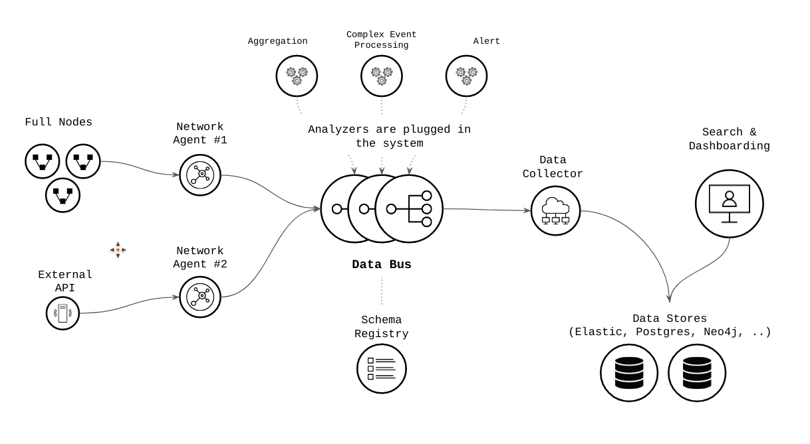

# Celo Monitoring Architecture

```
shortname:      ARCH
name:           Celo Monitoring Architecture
status:         Draft
version:        0.1
editor:         Aitor Argomaniz <aitor@keyko.io>
contributors:   
```

**Table of Contents**


---


## Motivation

This document describes the architecture decisions made during the design process of the Celo Monitoring tool.
The main motivations of the Celo monitoring tool are:

* Design a end to end solution able to surface the most relevant network health KPIs allowing 
  to take decisions with the information given
* Facilitates to the Protocol Economics tool to understand what's the health of the network in real time
* Provide a solution that allows to engage the community. Supports the delivery of information and 
  knowledge to the community, opening the possibility of users engagement.
* Provides an architecture able to scale, avoiding to re-architect the solution in the short term 
* Flexible & easy to ingest from multiple sources of data
* Facilitates to get benefit of the existing data and build insights and alerts 
* Allows to consolidate and export the data ready to be used internally (Circles, ) or with the 
  external community (validators, users, ..)
* Promotes the transparency and facilitates to engage the community allowing them to build on top of Celo
* Provides a solution reducing the operational and maintenance costs
* Provides a solution using Open Source Software

## Architecture

Based in the above motivations, the architecture provides a end to end data pipeline where:

- The data can be ingested/extracted from different sources
- The data is sent to highly-available and resilient data bus
- Generic transformation drivers clean, catalog, enrich and process the information in real-time
- The information generated from the input data is sent automatically to the persistence layer
- The information is stored and can be visualized by different kind of users
 


The solution architecture it's based in the following building blocks:

- Ingestion Agents - Agents able to connect to different sources.
  Initially using an agent connected to a Celo network node. It ingests all the data related to blocks, events, transactions and public state. 
  The agent is configurable via API, allowing to extend the elements to fetch from the network.
- Data Backbone -  Event driven data bus keeping all the incoming data and facilitating the event transformation 
  and further persistence in real-time.
- Celo Monitoring Engine - Small processors in charge of data cleansing, cataloging and transformation facilitating 
  further analysis and visualization.
- Storage and Visualization - Provides the capabilities of persist the information generated and visualize it in an easy way.




### Ingestion Agents

Ingestion agents are deployed in high availability and connected to network full nodes or external systems (WebSocket, Databases, Services, ..).
They are in charge of capture the data from the source system and send to the data backbone for further processing. 


#### Celo Network Agent

Initially the main agent available in the system is the `Celo Network Agent`. 
It's a programmable agents ingesting data from Celo network (blocks, transactions, events, public state of Smart Contracts).
This agent is provided using the [Keyko Web3 Monitoring Agent](https://github.com/keyko-io/web3-monitoring-agent) (Apache v2 License). 
More information about how to subscribe to events, transactions and views of the public state can be found in 
the [API doc page](https://github.com/keyko-io/web3-monitoring-agent/blob/master/doc/api.md).

#### Other Agents

Because the open design of the data backbone and the architecture, additional agents can be implemented to capture data from different sources.

### Transport Layer

It is provided by a Data Bus or Data Backbone. It persists the incoming data in real time supporting 
the ingestion of millions of events per second. 
In the transport layer the data is organized in independent topics, that can be used for consuming the 
data from independent users in different ways.
The transport layer is independent of the ingestion, processing or persistence layers.
Based on Apache Kafka and Schema Registry Open Source projects.

#### Schema Registry

It keeps the schemas of all the different event types going through the transport layer. 
The Transport Layer is integrated with a Schema Registry, and allows to manage the versions of the different data schemas, 
giving support to schema validation, evolution and backward compatibility.
It provides an API with the solution schema metadata, allowing for third-components to validate the schemas of the incoming messages.


### Transformation


### Data Collector

Retrieves the information in real time from different transport layer topics and persist in different data stores.
Allows a basic adaptation of the events allowing to persist in ElasticSearch, MongoDB, PostgreSQL, etc. 


### API and Visualization


## Technical Components


 


## References

* [FLOSS (Free Libre Open Source Software)](https://www.gnu.org/philosophy/floss-and-foss.en.html)

## Language

The key words "MUST", "MUST NOT", "REQUIRED", "SHALL", "SHALL NOT", "SHOULD", "SHOULD NOT", "RECOMMENDED", "NOT RECOMMENDED", "MAY", and "OPTIONAL" in this document are to be interpreted as described in [BCP 14](https://tools.ietf.org/html/bcp14) \[[RFC2119](https://tools.ietf.org/html/rfc2119)\] \[[RFC8174](https://tools.ietf.org/html/rfc8174)\] when, and only when, they appear in all capitals, as shown here.
